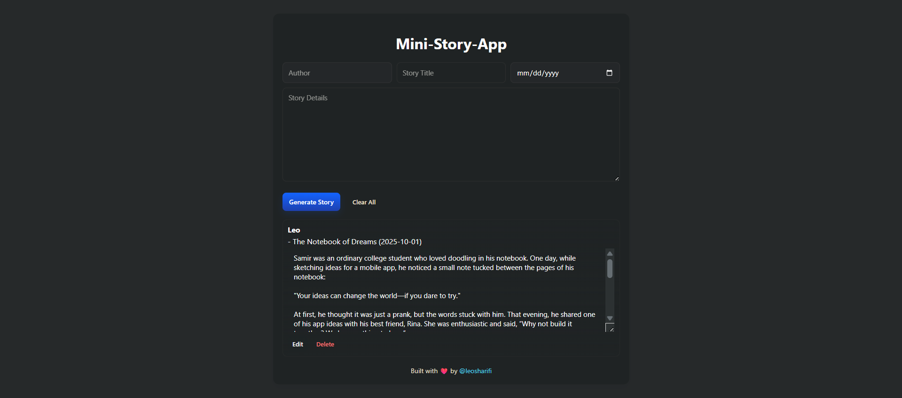

---

# Mini-Story-App

Mini-Story-App is a simple React application that allows users to create, edit, and manage small stories. Each story includes the author’s name, title, date, and detailed content. The app saves stories to **localStorage**, so they persist between page reloads.

---

## 🚀 Features

- ➕ Add new stories with author, title, date, and details.
- ✏️ Edit existing stories inline.
- 🗑️ Delete stories individually or clear all at once.
- 💾 Stories are saved to **localStorage** for persistence.
- 🧭 Created another page called **No Page (404)** using **React Router**.
- 🎨 Responsive and clean design.
- ❤️ Built with love using **React**.

---

## Installation

1. Clone the repository:
   ```bash
   git clone https://github.com/leoSharifi/mini-story-app.git
   ```
2. Run the Project:
   ```bash
   npm run dev
   ```
